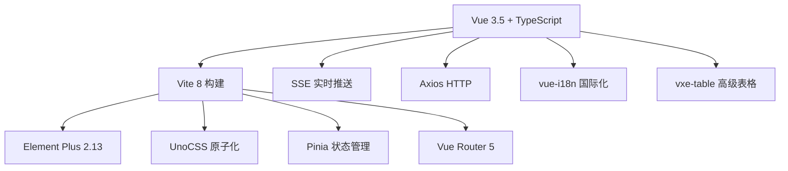
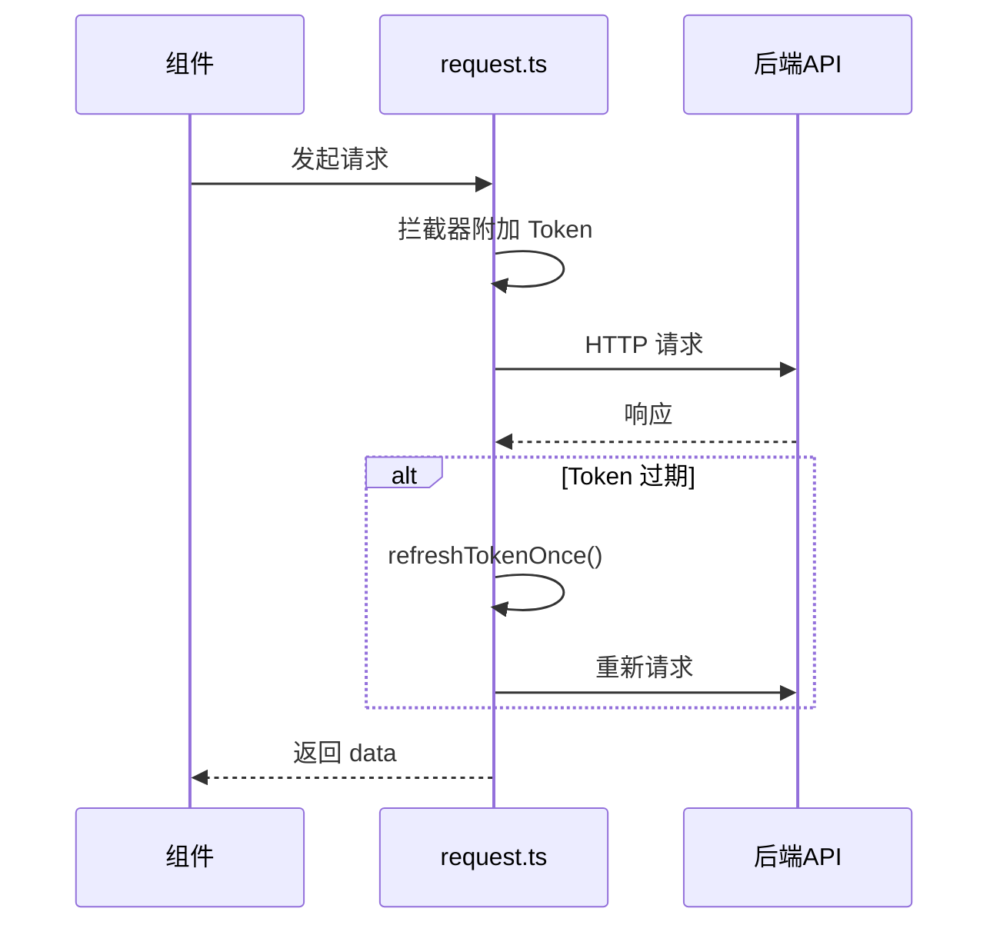
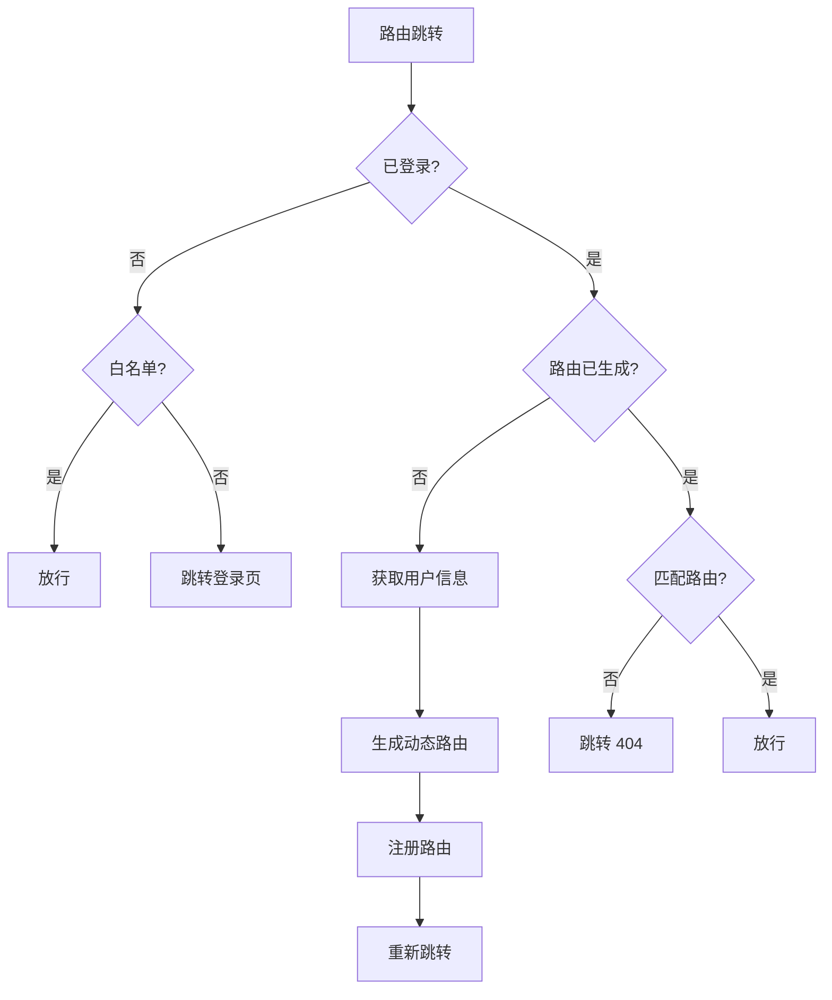
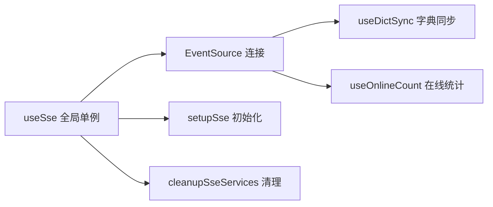

# Vue3-Element-Admin 通用模块技术架构文档

## 项目概览

**vue3-element-admin** 是基于 Vue 3.5 + Vite 8 + TypeScript + Element Plus 2.13 搭建的企业级后台管理前端模板，由"有来开源组织"维护。它是经典 vue-element-admin 的 Vue3 版本，开箱即用，配套 Java（youlai-boot）和 Node（youlai-nest）后端。



---

## 技术栈总览

| 分类 | 技术选型 | 版本 |
|------|---------|------|
| 框架 | Vue 3 | 3.5.30 |
| 构建工具 | Vite | 8.0.0 |
| 语言 | TypeScript | 5.9.3 |
| UI 框架 | Element Plus | 2.13.5 |
| 状态管理 | Pinia | 3.0.4 |
| 路由 | Vue Router | 5.0.3 |
| HTTP 客户端 | Axios | 1.13.6 |
| 国际化 | vue-i18n | 11.3.0 |
| CSS 方案 | UnoCSS + SCSS | - |
| 富文本编辑器 | wangEditor-next | 5.6.49 |
| 图表 | ECharts | 6.0.0 |
| 高级表格 | vxe-table | 4.6.25 |
| 拖拽排序 | SortableJS | 1.15.7 |
| Excel 处理 | ExcelJS | 4.4.0 |
| 代码编辑器 | CodeMirror | 5.65.21 |

---

## 目录结构

```
src/
├── api/            # API 接口层
│   ├── auth.ts     # 认证相关接口
│   ├── codegen.ts  # 代码生成接口
│   ├── file.ts     # 文件上传接口
│   └── system/     # 系统模块接口
│       ├── user.ts, role.ts, menu.ts
│       ├── dept.ts, dict.ts, config.ts
│       ├── log.ts, notice.ts, statistics.ts
│       └── tenant.ts, tenant-plan.ts
├── components/     # 公共组件（24个）
├── composables/    # 组合式函数
├── constants/      # 应用常量
├── directives/     # 自定义指令
├── enums/          # 枚举定义
├── lang/           # 国际化
├── layouts/        # 布局系统
├── plugins/        # 第三方插件配置
├── router/         # 路由配置
├── store/          # Pinia 状态管理
├── styles/         # 全局样式
├── types/          # TypeScript 类型
├── utils/          # 工具函数
└── views/          # 页面视图
```

---

## 通用模块详解

### 1. 请求层（src/utils/request.ts）

基于 Axios 封装的统一 HTTP 请求模块，提供请求/响应拦截、Token 自动刷新、错误统一处理等能力。

**核心特性：**
- **请求拦截**：自动从 AuthStorage 读取 Token 附加到 Authorization 头
- **Token 刷新**：遇到 Token 过期时自动刷新并重试（单飞模式防并发）
- **错误处理**：统一的错误码处理（SUCCESS / TOKEN_INVALID / PERMISSION_DENIED）
- **二进制支持**：blob/arraybuffer 类型响应直接透传
- **参数序列化**：使用 qs 库，数组参数使用 repeat 格式



**使用方式：**

```typescript
import request from "@/utils/request";
// 发送 GET 请求
request<any, UserVO>({ url: "/api/v1/users", method: "get", params: {} });
// 发送 POST 请求
request({ url: "/api/v1/users", method: "post", data: formData });
```

---

### 2. 认证管理（src/utils/auth.ts）

管理本地凭证（Token）和权限判断。

**AuthStorage 对象：**
- `getAccessToken()` / `getRefreshToken()`：根据"记住我"状态从 localStorage 或 sessionStorage 读取
- `setTokens(accessToken, refreshToken, rememberMe)`：设置 Token
- `clearAuth()`：清除所有凭证

**权限判断函数：**
- `hasPerm(value, type)`：判断按钮级权限或角色权限，ROOT 角色拥有全部权限
- `redirectToLogin(message)`：重置状态并跳转到登录页

---

### 3. 存储工具（src/utils/storage.ts）

封装 localStorage 和 sessionStorage 的统一操作类，支持自动 JSON 序列化。

**核心方法：**
- `Storage.set(key, value)` / `Storage.get<T>(key, defaultValue)`：localStorage 读写
- `Storage.sessionSet()` / `Storage.sessionGet()`：sessionStorage 读写
- `Storage.clearByPrefix(prefix)`：按前缀批量清理
- `Storage.clearAllProject()`：清理所有项目存储（以 vea: 前缀标识）

---

### 4. 常量管理（src/constants/index.ts）

统一管理应用常量，遵循 `{APP_PREFIX}:{分类}:{具体名称}` 命名规范。

**关键常量：**
- `APP_PREFIX = "vea"`：所有存储键的前缀
- `ROLE_ROOT = "ROOT"`：超级管理员角色标识
- `PLATFORM_TENANT_ID = 0`：平台租户 ID
- `STORAGE_KEYS`：包含认证、租户、UI 设置、应用状态等 20+ 个存储键名

---

### 5. 枚举系统（src/enums/）

按业务域分组的枚举定义，全部使用 const enum 优化编译体积。

| 文件 | 包含枚举 |
|------|---------|
| api.ts | ApiCodeEnum（SUCCESS, TOKEN_INVALID, PERMISSION_DENIED 等） |
| settings.ts | ThemeMode, LayoutMode, ComponentSize, LanguageEnum, DeviceEnum 等 |
| business.ts | MenuTypeEnum, MenuScopeEnum, UserGender |
| common.ts | DialogMode, CommonStatus, AuditStatus |
| codegen.ts | 代码生成相关枚举 |

---

### 6. 路由系统（src/router/）

使用 Vue Router 5，基于 Hash 模式（createWebHashHistory）。

**核心架构：**
- **静态路由**：constantRoutes 包含登录页、Dashboard、错误页、个人中心等
- **动态路由**：从后端 API 获取菜单数据，通过 import.meta.glob 动态导入 View 组件
- **路由守卫**：setupPermissionGuard() 处理登录验证、动态路由生成、404 检测



---

### 7. 状态管理（src/store/）

基于 Pinia 3，使用 Composition API 风格（defineStore + setup），共 7 个 Store 模块：

| Store | 职责 |
|-------|------|
| useAppStore | 设备类型、侧边栏状态、语言、组件大小 |
| useSettingsStore | 主题模式、主题色、布局、TagsView 显隐、水印等 |
| useUserStore | 登录/登出/Token 刷新/用户信息/状态重置 |
| usePermissionStore | 动态路由生成、路由重置、权限快照刷新 |
| useTagsViewStore | 标签页管理（增删改查、左右关闭、KeepAlive 缓存） |
| useDictStore | 字典数据缓存、防重复请求队列 |
| useTenantStore | 多租户管理（租户列表、切换、Token 刷新） |

每个 Store 都导出 `useXxxStoreHook()` 函数，用于在组件外部（如路由守卫、拦截器）访问 Store 实例。

---

### 8. 组合式函数（src/composables/）

| Composable | 功能 |
|------------|------|
| useSse() | 全局 SSE 连接管理（单例模式），支持事件订阅/取消 |
| useDictSync() | 字典变更实时同步（通过 SSE 推送） |
| useOnlineCount() | 在线用户数统计（通过 SSE 推送） |
| useTableSelection() | 表格行选择逻辑封装 |
| useRecentMenus() | 最近访问菜单记录（localStorage 持久化） |



---

### 9. 自定义指令（src/directives/）

| 指令 | 用途 |
|------|------|
| v-hasPerm | 按钮级权限控制，无权限则移除 DOM 元素 |
| v-hasRole | 角色权限控制，无权限则移除 DOM 元素 |

**使用示例：**

```html
<el-button v-has-perm="'sys:user:create'">新增用户</el-button>
<el-button v-has-role="'ADMIN'">管理员可见</el-button>
```

---

### 10. 布局系统（src/layouts/）

支持三种布局模式，通过 Settings 面板动态切换：

| 布局 | 组件 | 说明 |
|------|------|------|
| 左侧菜单 | LeftLayout.vue | 经典左侧导航 + 顶部栏 |
| 顶部菜单 | TopLayout.vue | 导航在顶部 |
| 混合菜单 | MixLayout.vue | 顶部一级 + 左侧二级 |

useLayout() Composable 整合了设备检测（响应式 992px 断点）、布局状态、菜单数据。

---

### 11. 公共组件（src/components/）

24 个开箱即用的公共组件：

| 组件 | 功能 |
|------|------|
| CURD | 低代码增删改查框架（PageSearch + PageContent + PageModal） |
| Pagination | 分页组件 |
| DictTag / DictSelect | 字典标签展示 / 字典下拉选择 |
| ECharts | ECharts 图表封装 |
| WangEditor | 富文本编辑器封装 |
| Upload | 文件上传组件 |
| OperationColumn | 表格操作列 |
| TableSelect | 表格选择器 |
| InputTag | 标签输入组件 |
| IconSelect | 图标选择器 |
| TenantSwitcher | 租户切换器 |
| ThemeSwitch | 主题切换 |
| Fullscreen | 全屏切换 |
| SizeSelect | 组件大小选择 |
| LangSelect | 语言选择 |
| Breadcrumb | 面包屑导航 |
| Hamburger | 侧边栏折叠按钮 |
| AppLink | 内外链智能路由 |
| CopyButton | 复制按钮 |
| TextScroll | 文字滚动 |
| NoticeDropdown | 通知下拉 |
| CommandPalette | 命令面板 |
| GithubCorner | GitHub 角标 |

**CURD 组件**是核心亮点，提供声明式配置驱动的 CRUD 页面：

```typescript
// 搜索配置
const searchConfig: ISearchConfig = { formItems: [...] };
// 内容配置（表格 + 分页 + 工具栏）
const contentConfig: IContentConfig = { cols: [...], indexAction: API.getPage };
// 弹窗配置（Dialog/Drawer + 表单）
const modalConfig: IModalConfig = { formItems: [...], formAction: API.create };
```

---

### 12. 工具函数（src/utils/）

| 模块 | 功能 |
|------|------|
| validate.ts | 数据验证（URL、邮箱、手机号、外部链接）+ Element Plus 表单规则生成器 |
| format.ts | 数据格式化（增长率、文件大小、千分位、人民币金额） |
| theme.ts | 主题色生成（浅色/深色变体）、暗黑模式切换、侧边栏配色切换 |
| tenant.ts | 多租户工具（启用判断、平台租户判断） |
| download.ts | 文件下载（从响应头提取文件名，支持 UTF-8 编码） |

---

### 13. 类型系统（src/types/）

分为两大部分：
- **API 类型**（types/api/）：按模块定义请求/响应类型（auth、user、menu、role 等）
- **UI 类型**（types/ui/）：TagView、AppSettings 等 UI 相关类型
- **全局类型**（global.d.ts）：声明 ApiResponse、PageResult、TagView 等全局类型

---

### 14. 应用配置（src/settings.ts）

集中管理应用元信息和用户偏好默认值：
- `appConfig`：应用名称、版本、多租户开关（从环境变量读取）
- `defaults`：主题、主题色、布局、语言、TagsView 显隐等默认值
- `themeColorPresets`：10 个预设主题色

---

### 15. 插件系统（src/plugins/）

| 插件 | 功能 |
|------|------|
| vxe-table.ts | vxe-table 全局配置（国际化、空数据提示等） |
| nprogress.ts | 页面加载进度条 |

---

## 关键设计模式

### 单飞模式（Singleton Flyweight）

项目多处使用"单飞模式"防止并发重复操作：

```typescript
let refreshPromise: Promise<void> | null = null;
function refreshTokenOnce(): Promise<void> {
  if (refreshPromise) return refreshPromise;
  refreshPromise = doRefreshToken().finally(() => {
    refreshPromise = null;
  });
  return refreshPromise;
}
```

应用场景：Token 刷新、动态路由重载、权限快照刷新。

### Store Hook 模式

每个 Store 导出 useXxxStoreHook() 函数，解决在非组件上下文中（拦截器、路由守卫）使用 Store 的问题：

```typescript
export function useUserStoreHook() {
  return useUserStore(store); // 传入已创建的 pinia 实例
}
```

### 自动导入

项目使用 unplugin-auto-import 和 unplugin-vue-components 实现：
- Vue、Vue Router、Pinia、Element Plus 等 API 自动导入
- Element Plus 组件自动按需注册

---

## 开发流程

```bash
# 环境要求：Node.js ^20.19.0 || >=22.12.0，pnpm >= 8.0.0

pnpm install          # 安装依赖
pnpm run dev          # 启动开发服务器
pnpm run build        # 生产构建（含类型检查）
pnpm run build-only   # 仅构建（跳过类型检查）
pnpm run lint         # 代码规范检查（ESLint + Prettier + Stylelint）
pnpm run commit       # 规范化提交（commitizen + cz-git）
```

**Git 提交规范**：Husky + Lint-staged + Commitlint + Commitizen + cz-git

---

## 环境变量

| 变量 | 说明 |
|------|------|
| VITE_APP_TITLE | 应用标题 |
| VITE_APP_BASE_API | API 基础路径（如 /dev-api） |
| VITE_APP_TENANT_ENABLED | 是否启用多租户 |
| VITE_MOCK_DEV_SERVER | 是否启用本地 Mock |
